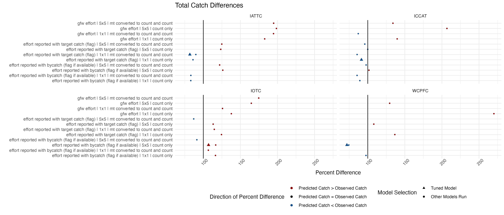

Comparison between observed and predicted catch for different RFMOs and different models. Note that the following figures only include data from testing datasets (a subset of the full dataset). 

Chosen model results are based on the best performing models (in terms of R^2^) that were run prior to the week of April 4, 2022 and are subject to change as models are improved. 

```{r setup, include=FALSE}
knitr::opts_chunk$set(
	eval = FALSE,
	message = FALSE,
	warning = FALSE,
	include = FALSE, 
	eval = FALSE
)
# Load libraries
library(tidyverse)

input_loc = "../../data/model-data/outputs/all-rfmo-models/"
```

```{r}
# Load data
results <- read.csv(paste0(input_loc, "5x5_count_all_rfmos_effort_test_data.csv")) %>% 
  mutate(spatial_resolution = "5x5", 
         catch_units = "count only") %>% 
  bind_rows(read.csv(paste0(input_loc, "5x5_mt_to_count_all_rfmos_effort_test_data.csv")) %>% 
              mutate(spatial_resolution = "5x5", 
                     catch_units = "mt converted to count and count")) %>% 
  bind_rows(read.csv(paste0(input_loc, "1x1_count_all_rfmos_effort_test_data.csv")) %>% 
              mutate(spatial_resolution = "1x1", 
                     catch_units = "count only")) %>% 
  bind_rows(read.csv(paste0(input_loc, "1x1_mt_to_count_all_rfmos_effort_test_data.csv")) %>% 
              mutate(spatial_resolution = "1x1", 
                     catch_units = "mt converted to count and count")) 

results <- results %>% 
  mutate(effort_source = gsub("bycatch [(]flag[)]", "bycatch (flag if available)", effort_source))

# Calculate percent difference
results_perc_difference <- results %>% 
  mutate(perc_difference = 100*(((.final_pred - catch)/catch)+1), 
         perc_difference = ifelse(.final_pred == catch & .final_pred == 0, 100, perc_difference)) %>%
  filter(!is.infinite(perc_difference)) %>% 
  group_by(rfmo, effort_source, spatial_resolution, catch_units) %>% 
  summarise(mean_perc_difference = mean(perc_difference, na.rm = T), 
            median_perc_difference = median(perc_difference, na.rm = T), 
            sd_perc_difference = sd(perc_difference, na.rm = T), 
            n = n()) %>% 
  ungroup()

# write.csv(results_perc_difference, paste0(input_loc, "percent_differences_all_models.csv"), row.names = F)

results_perc_difference_latlon <- results %>% 
  group_by(rfmo, effort_source, spatial_resolution, catch_units, latitude, longitude) %>% 
  summarise(sum_final_pred = sum(.final_pred), 
            sum_catch = sum(catch)) %>% 
  ungroup() %>% 
  mutate(perc_difference = 100*(((sum_final_pred - sum_catch)/sum_catch)+1),
         perc_difference = ifelse(sum_final_pred == sum_catch & sum_final_pred == 0, 100, perc_difference)) %>%
  filter(!is.infinite(perc_difference)) %>% 
  group_by(rfmo, effort_source, spatial_resolution, catch_units) %>% 
  summarise(mean_perc_difference = mean(perc_difference, na.rm = T), 
            median_perc_difference = median(perc_difference, na.rm = T), 
            sd_perc_difference = sd(perc_difference, na.rm = T), 
            n = n()) %>% 
  ungroup()
  

results_perc_difference_total <- results %>% 
  group_by(rfmo, effort_source, spatial_resolution, catch_units) %>% 
  summarise(sum_final_pred = sum(.final_pred), 
            sum_catch = sum(catch)) %>% 
  ungroup() %>% 
  mutate(perc_difference = 100*(((sum_final_pred - sum_catch)/sum_catch)+1))  %>%
  filter(!is.infinite(perc_difference)) 
  

results_perc_difference_chosen_models <- results_perc_difference %>% 
  filter((rfmo == "IOTC" & spatial_resolution == "5x5" & catch_units == "count only" & effort_source == "effort reported with bycatch (flag if available)") |
           (rfmo == "ICCAT" & spatial_resolution == "1x1" & catch_units == "count only" & effort_source == "effort reported with target catch (flag)") | 
           (rfmo == "IATTC" & spatial_resolution == "1x1" & catch_units == "mt converted to count and count" & effort_source == "effort reported with target catch (flag)") | 
           (rfmo == "WCPFC" & spatial_resolution == "5x5" & catch_units == "count only" & effort_source == "effort reported with bycatch (flag if available)"))

write.csv(results_perc_difference_chosen_models, paste0(input_loc, "percent_differences_chosen_models.csv"), row.names = F)
```

Percent difference was calculated as: 

$$
 difference = (\frac{predicted- observed}{observed} + 1)*100
$$

In the above equation, predicted refers to the model-predicted catch and observed refers to the observer-reported catch. 

The final percent difference estimates are based on a scale so that: 

- If predicted catch > observed catch, % difference > 100
- If predicted catch = observed catch, % difference = 100
- If predicted catch < observed catch, % difference < 100

We calculated percent difference for the following scenarios: 

- Mean percent difference by model at a cell-by-cell and species-by-species scale
- Mean percent difference by model at a cell-by-cell scale (summed estimates for all species)
- Percent difference by model (summed estimates for all cells and all species)

# Mean Percent Difference at a Cell-by-Cell and Species-by-Species Scale

```{r}
ggplot() + 
  geom_point(data = results_perc_difference %>% 
             mutate(model = paste(effort_source, spatial_resolution, catch_units, sep = " | "), 
                    color = case_when(mean_perc_difference > 100 ~ "Predicted Catch > Observed Catch", 
                                      mean_perc_difference < 100 ~ "Predicted Catch < Observed Catch", 
                                      mean_perc_difference == 100 ~ "Predicted Catch = Observed Catch"), 
                    color = factor(color, levels = c("Predicted Catch > Observed Catch", 
                                           "Predicted Catch = Observed Catch", 
                                           "Predicted Catch < Observed Catch")), 
                    shape = case_when((rfmo == "IOTC" & spatial_resolution == "5x5" & catch_units == "count only" & effort_source == "effort reported with bycatch (flag if available)") | (rfmo == "ICCAT" & spatial_resolution == "1x1" & catch_units == "count only" & effort_source == "effort reported with target catch (flag)") | 
           (rfmo == "IATTC" & spatial_resolution == "1x1" & catch_units == "mt converted to count and count" & effort_source == "effort reported with target catch (flag)") | 
           (rfmo == "WCPFC" & spatial_resolution == "5x5" & catch_units == "count only" & effort_source == "effort reported with bycatch (flag if available)") ~ "Selected Model (Subject to Change)", TRUE ~ "Other Models Run")), 
           mapping = aes(x = mean_perc_difference, y = model, color = color,
                         shape = shape)) + 
  scale_color_manual(name = "Direction of Percent Difference", values = c("Predicted Catch > Observed Catch" = "darkred", 
                                           "Predicted Catch = Observed Catch" = "black", 
                                           "Predicted Catch < Observed Catch" = "dodgerblue4"),
                     breaks = c("Predicted Catch > Observed Catch", 
                                           "Predicted Catch = Observed Catch", 
                                           "Predicted Catch < Observed Catch"), 
                     drop = FALSE, 
                     guide = guide_legend(ncol = 1)) + 
  scale_shape_manual(name = "Model Selection", values = c("Selected Model (Subject to Change)" = 17, 
                                           "Other Models Run" = 16), 
                     breaks = c("Selected Model (Subject to Change)", "Other Models Run"), 
                     guide = guide_legend(ncol = 1)) + 
  facet_wrap(vars(rfmo)) + 
  geom_vline(xintercept = 100) + 
  xlab("Mean Percent Difference") + 
  ylab("") + 
  ggtitle("Cell-by-Cell, Species-by-Species Differences") + 
  theme_minimal() + 
  theme(legend.position = "bottom", 
        axis.text.x = element_text(angle = 45))

ggsave("cellbycell_sppbyspp_perc_difference.png", width = 14, height = 6, units = "in", bg = "white")
```


# Mean Percent Difference at a Cell-by-Cell Scale

```{r fig.height= 3, fig.width = 6, out.width = "11in"}
ggplot() + 
  geom_point(data = results_perc_difference_latlon %>% 
             mutate(model = paste(effort_source, spatial_resolution, catch_units, sep = " | "), 
                    color = case_when(mean_perc_difference > 100 ~ "Predicted Catch > Observed Catch", 
                                      mean_perc_difference < 100 ~ "Predicted Catch < Observed Catch", 
                                      mean_perc_difference == 100 ~ "Predicted Catch = Observed Catch"), 
                    color = factor(color, levels = c("Predicted Catch > Observed Catch", 
                                           "Predicted Catch = Observed Catch", 
                                           "Predicted Catch < Observed Catch")), 
                    shape = case_when((rfmo == "IOTC" & spatial_resolution == "5x5" & catch_units == "count only" & effort_source == "effort reported with bycatch (flag if available)") | (rfmo == "ICCAT" & spatial_resolution == "1x1" & catch_units == "count only" & effort_source == "effort reported with target catch (flag)") | 
           (rfmo == "IATTC" & spatial_resolution == "1x1" & catch_units == "mt converted to count and count" & effort_source == "effort reported with target catch (flag)") | 
           (rfmo == "WCPFC" & spatial_resolution == "5x5" & catch_units == "count only" & effort_source == "effort reported with bycatch (flag if available)") ~ "Selected Model (Subject to Change)", TRUE ~ "Other Models Run")), 
           mapping = aes(x = mean_perc_difference, y = model, color = color,
                         shape = shape)) + 
  scale_color_manual(name = "Direction of Percent Difference", values = c("Predicted Catch > Observed Catch" = "darkred", 
                                           "Predicted Catch = Observed Catch" = "black", 
                                           "Predicted Catch < Observed Catch" = "dodgerblue4"),
                     breaks = c("Predicted Catch > Observed Catch", 
                                           "Predicted Catch = Observed Catch", 
                                           "Predicted Catch < Observed Catch"), 
                     drop = FALSE, 
                     guide = guide_legend(ncol = 1)) + 
  scale_shape_manual(name = "Model Selection", values = c("Selected Model (Subject to Change)" = 17, 
                                           "Other Models Run" = 16), 
                     breaks = c("Selected Model (Subject to Change)", "Other Models Run"), 
                     guide = guide_legend(ncol = 1)) + 
  facet_wrap(vars(rfmo)) + 
  geom_vline(xintercept = 100) + 
  xlab("Mean Percent Difference") + 
  ylab("") + 
  ggtitle("Cell-by-Cell Differences") + 
  theme(legend.position = "bottom", 
        axis.text.x = element_text(angle = 45))

ggsave("cellbycell_perc_difference.png", width = 14, height = 6, units = "in", bg = "white")
```


# Mean Percent Difference

```{r fig.height= 3, fig.width = 6, out.width = "11in"}
ggplot() + 
  geom_point(data = results_perc_difference_total %>% 
             mutate(model = paste(effort_source, spatial_resolution, catch_units, sep = " | "), 
                    color = case_when(perc_difference > 100 ~ "Predicted Catch > Observed Catch", 
                                      perc_difference < 100 ~ "Predicted Catch < Observed Catch", 
                                      perc_difference == 100 ~ "Predicted Catch = Observed Catch"), 
                    color = factor(color, levels = c("Predicted Catch > Observed Catch", 
                                           "Predicted Catch = Observed Catch", 
                                           "Predicted Catch < Observed Catch")), 
                    shape = case_when((rfmo == "IOTC" & spatial_resolution == "5x5" & catch_units == "count only" & effort_source == "effort reported with bycatch (flag if available)") | (rfmo == "ICCAT" & spatial_resolution == "1x1" & catch_units == "count only" & effort_source == "effort reported with target catch (flag)") | 
           (rfmo == "IATTC" & spatial_resolution == "1x1" & catch_units == "mt converted to count and count" & effort_source == "effort reported with target catch (flag)") | 
           (rfmo == "WCPFC" & spatial_resolution == "5x5" & catch_units == "count only" & effort_source == "effort reported with bycatch (flag if available)") ~ "Selected Model (Subject to Change)", TRUE ~ "Other Models Run")), 
           mapping = aes(x = perc_difference, y = model, color = color,
                         shape = shape)) + 
  scale_color_manual(name = "Direction of Percent Difference", values = c("Predicted Catch > Observed Catch" = "darkred", 
                                           "Predicted Catch = Observed Catch" = "black", 
                                           "Predicted Catch < Observed Catch" = "dodgerblue4"),
                     breaks = c("Predicted Catch > Observed Catch", 
                                           "Predicted Catch = Observed Catch", 
                                           "Predicted Catch < Observed Catch"), 
                     drop = FALSE, 
                     guide = guide_legend(ncol = 1)) + 
  scale_shape_manual(name = "Model Selection", values = c("Selected Model (Subject to Change)" = 17, 
                                           "Other Models Run" = 16), 
                     breaks = c("Selected Model (Subject to Change)", "Other Models Run"), 
                     guide = guide_legend(ncol = 1)) + 
  facet_wrap(vars(rfmo)) + 
  geom_vline(xintercept = 100) + 
  xlab("Percent Difference") + 
  ylab("") + 
  ggtitle("Total Catch Differences") + 
  theme_minimal() + 
  theme(legend.position = "bottom", 
        axis.text.x = element_text(angle = 45))

ggsave("total_perc_difference.png", width = 14, height = 6, units = "in", bg = "white")
```




